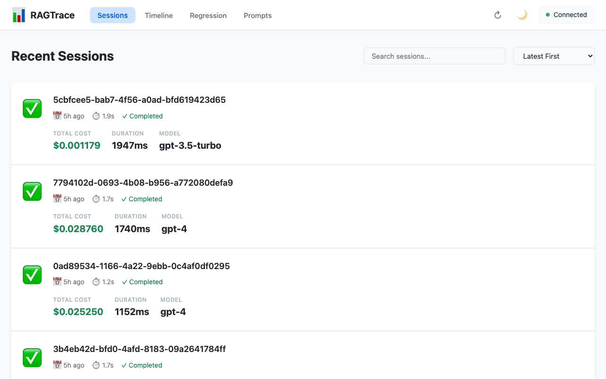

# RAGTrace 📊

> **Observability for RAG pipelines** - Trace, inspect, optimize, and regression-test Retrieval-Augmented Generation systems with ease.

[](https://www.python.org/downloads/)
[](https://opensource.org/licenses/MIT)
[](https://github.com/psf/black)



## ✨ What is RAGTrace?

RAGTrace is a lightweight observability layer for RAG (Retrieval-Augmented Generation) systems that captures and visualizes every step of your pipeline:

- 🔍 **Event Capture** - Automatically intercepts retrieval, prompt, and generation events
- 💰 **Cost Tracking** - Accurate token counting and cost estimation per query (GPT-4o, Claude, Gemini, o1/o3 and more)
- 📊 **Interactive Web UI** - Modern timeline view with charts, filters, and event inspection
- 🔧 **CLI Tool** - Developer-friendly command-line interface
- 🌐 **REST API** - Query and analyze sessions programmatically
- 🧪 **Regression Testing** - Snapshot and compare RAG outputs with scoring
- 📝 **Prompt Versioning** - Track and diff prompt template changes over time
- 🦙 **LlamaIndex Support** - First-class LlamaIndex callback integration

**Think of it as OpenTelemetry, but specifically for RAG pipelines.**

## ❓ Why RAGTrace?

Building RAG systems with frameworks like LangChain and LlamaIndex is powerful, but debugging them is often difficult. When a pipeline produces a bad answer, developers typically struggle to pinpoint the cause:

- 📄 Which documents were actually retrieved?
- 🧩 How was the prompt constructed from those documents?
- 🤔 Why did the model generate that specific response?
- 💸 Where is token usage and cost accumulating?

RAGTrace solves this by making RAG pipelines **observable and debuggable**. It captures the entire execution of a RAG query and presents it as a structured, inspectable trace — so you can answer those questions in seconds rather than hours.

### How RAGTrace fits into the RAG stack

| Tool           | Purpose                                              |
|----------------|------------------------------------------------------|
| **LangChain**  | Build LLM applications and pipelines                 |
| **LlamaIndex** | Manage data ingestion and retrieval for RAG          |
| **RAGTrace**   | Debug, inspect, and optimize RAG pipelines           |

RAGTrace does **not** replace LangChain or LlamaIndex — it works alongside them as a non-invasive observability layer, the same way you'd add a tracer to any distributed system.

### When to use RAGTrace

RAGTrace is particularly useful when:

- Your RAG system produces incorrect or hallucinated answers
- Retrieved documents seem irrelevant to the query
- You need to understand exactly how a prompt was assembled
- Token usage or costs are higher than expected
- You want to compare two versions of a pipeline side-by-side (regression testing)
- You need to track changes to prompt templates over time

By making RAG pipelines transparent, RAGTrace helps you iterate faster and build more reliable AI systems.

## 🚀 Quick Start

### Installation

```bash
# Clone the repository
git clone https://github.com/yourusername/ragtrace.git
cd ragtrace

# Install dependencies
pip install -e .

# Initialize database
ragtrace init
```

### Basic Usage (LangChain)

```python
from langchain.vectorstores import FAISS
from langchain.embeddings import OpenAIEmbeddings
from langchain.chat_models import ChatOpenAI
from langchain.chains import RetrievalQA
from ragtrace import RagTracer

# Your existing RAG setup
embeddings = OpenAIEmbeddings()
vectorstore = FAISS.from_texts(["Your documents here..."], embeddings)
llm = ChatOpenAI(model="gpt-4o-mini")

# Add RAGTrace - just one line!
tracer = RagTracer(auto_save=True)

chain = RetrievalQA.from_chain_type(
    llm=llm,
    retriever=vectorstore.as_retriever(),
    callbacks=[tracer]  # ← Automatic capture!
)

result = chain.run("What is RAG?")
```

### Basic Usage (LlamaIndex)

```python
from llama_index.core import VectorStoreIndex, SimpleDirectoryReader
from ragtrace.llamaindex import SimpleRagTracerLlamaIndex

# Build your index
documents = SimpleDirectoryReader("data/").load_data()
index = VectorStoreIndex.from_documents(documents)

# Use as a context manager – automatically saves on exit
with SimpleRagTracerLlamaIndex() as tracer:
    query_engine = index.as_query_engine(
        callbacks=[tracer]
    )
    response = query_engine.query("What is RAG?")
    session_id = tracer.session_id

print(f"Session saved: {session_id}")
```

### View Results

```bash
# View latest session in CLI
ragtrace show last

# List all sessions
ragtrace list

# Export to JSON
ragtrace export <session-id> > session.json

# Start API + Web UI
ragtrace run                  # API on :8000
python ui/serve.py            # UI on :3000
```

## 🌐 Web UI

RAGTrace includes a modern web interface for visualizing and analyzing your RAG pipelines:

```bash
# Terminal 1: Start API server
uvicorn api.main:app --host 0.0.0.0 --port 8000 --reload

# Terminal 2: Start UI server
python ui/serve.py
```

Then open **http://localhost:3000** in your browser.

### Web UI Features

- **📋 Sessions View** - Browse all captured RAG sessions with search and filtering
- **📊 Timeline View** - Interactive timeline showing retrieval → prompt → generation flow
- **📈 Performance Charts** - Waterfall chart for event durations, cost breakdown by component
- **🔍 Event Inspector** - Click any event to see full details including tokens, costs, and data
- **📸 Regression Tab** - Create snapshots and run side-by-side regression comparisons
- **📝 Prompts Tab** - Register prompt templates, browse versions, and view inline diffs
- **📤 Export Tools** - Export session data as JSON or CSV, copy to clipboard

## 📊 Example Output

```
╭─ Session: d4f3a8b2-... ─────────────────────────────────╮
│ Query: What is RAG?                                      │
│ Model: gpt-4o-mini                                       │
│ Cost: $0.00012                                           │
│ Duration: 1,250ms                                        │
╰──────────────────────────────────────────────────────────╯

┏━━━━━━━━━━━━━┳━━━━━━━━━━━━┳━━━━━━━━━━━━┓
┃ Event       ┃ Duration   ┃ Cost       ┃
┡━━━━━━━━━━━━━╇━━━━━━━━━━━━╇━━━━━━━━━━━━┩
│ Retrieval   │ 150ms      │ $0.00001   │
│ Prompt      │ 0ms        │ $0.00000   │
│ Generation  │ 1,100ms    │ $0.00011   │
└─────────────┴────────────┴────────────┘
```

## 🎯 Features

### ✅ Core Features

- **Automatic Event Capture** - Works with LangChain and LlamaIndex callbacks
- **Cost Tracking** - tiktoken-based accurate token counting (2025/2026 pricing)
- **Timeline Visualization** - See your RAG pipeline in action
- **Session Management** - Store and retrieve debugging sessions
- **CLI Tool** - Rich formatted terminal output
- **REST API** - FastAPI server with OpenAPI docs
- **Web UI** - Interactive timeline with charts and event inspection
- **JSON/CSV Export** - Export sessions for analysis
- **Regression Testing** - Save snapshots and score retrieval/answer regressions
- **Prompt Versioning** - Version control for prompt templates with diff view

### 🎨 CLI Commands

```bash
ragtrace init                              # Initialize database
ragtrace list                              # List recent sessions
ragtrace show [id]                         # View session details
ragtrace show last                         # View latest session
ragtrace export <id>                       # Export session to JSON
ragtrace clear                             # Clear all data
ragtrace run                               # Start API server

# Snapshot & regression
ragtrace snapshot save <name>              # Create a named snapshot
ragtrace snapshot list                     # List all snapshots
ragtrace snapshot compare <id1> <id2>      # Compare snapshots (rich report)
ragtrace snapshot compare <id1> <id2> --json  # Machine-readable output

# Prompt versioning
ragtrace prompt save <name> <template.txt> # Save a prompt version
ragtrace prompt list                       # List all prompt names
ragtrace prompt list <name>                # List versions for a prompt
ragtrace prompt show <name>                # Show active template
ragtrace prompt show <name> -v 2           # Show specific version
ragtrace prompt diff <name> 1 2            # Colored unified diff
```

### 🌐 API Endpoints

```
# Sessions
POST   /api/sessions                          Create session
GET    /api/sessions                          List sessions
GET    /api/sessions/{id}                     Get session
PATCH  /api/sessions/{id}                     Update session
DELETE /api/sessions/{id}                     Delete session
POST   /api/sessions/{id}/events              Add event
GET    /api/sessions/{id}/cost                Get session cost

# Snapshots & regression
POST   /api/snapshots                         Create snapshot
GET    /api/snapshots                         List snapshots
GET    /api/snapshots/{id}                    Get snapshot
DELETE /api/snapshots/{id}                    Delete snapshot
GET    /api/snapshots/{id1}/compare/{id2}     Full comparison result
GET    /api/snapshots/{id1}/score/{id2}       Regression score (PASS/WARN/FAIL)

# Prompt versioning
GET    /api/prompts                           List prompt names
POST   /api/prompts                           Save new prompt version
GET    /api/prompts/{name}                    List versions for a prompt
GET    /api/prompts/{name}/active             Get active version
GET    /api/prompts/{name}/versions/{v}       Get specific version
GET    /api/prompts/{name}/diff/{va}/{vb}     Diff two versions
DELETE /api/prompts/{name}/versions/{v}       Delete a version

# Stats & costs
GET    /api/stats                             Aggregate stats
GET    /api/cost/breakdown                    Cost breakdown
```

Visit `http://localhost:8000/docs` after running `ragtrace run` for interactive API documentation.

## 🏗️ Architecture

```
ragtrace/
├── core/              # Core business logic
│   ├── models.py      # Pydantic v2 data models (Session, Snapshot, PromptVersion…)
│   ├── storage.py     # SQLite database layer (sessions, snapshots, prompt_versions)
│   ├── cost.py        # Token counting & 2025/2026 cost table
│   ├── capture.py     # Event aggregation & unused-chunk detection
│   └── regression.py  # Snapshot diff engine (Jaccard + SequenceMatcher scoring)
├── langchain/         # LangChain integration
│   └── middleware.py  # BaseCallbackHandler implementation
├── llamaindex/        # LlamaIndex integration
│   └── middleware.py  # RagTracerLlamaIndex + SimpleRagTracerLlamaIndex
├── api/               # REST API (FastAPI)
│   ├── main.py        # FastAPI application
│   └── routes.py      # All API endpoints (30+)
├── ui/                # Web UI (HTML/CSS/Vanilla JS)
│   ├── index.html     # Main UI page
│   ├── app.js         # Frontend application (sessions, timeline, regression, prompts)
│   ├── styles.css     # UI styling
│   └── serve.py       # Development server
├── cli/               # Command-line interface
│   └── main.py        # Click CLI (snapshot compare, prompt group)
├── examples/          # Usage examples
│   └── simple_rag.py  # Complete working example
└── tests/             # Test suite (150+ tests)
    ├── test_cost.py
    ├── test_storage.py
    ├── test_capture.py
    ├── test_regression.py
    ├── test_prompt_versioning.py
    └── test_llamaindex.py
```

## 🧪 Regression Testing

RAGTrace makes it easy to catch regressions between RAG pipeline versions:

```bash
# 1. Save a baseline snapshot after a good run
ragtrace snapshot save "v1-baseline"

# 2. Make pipeline changes, run again, then snapshot
ragtrace snapshot save "v2-candidate"

# 3. Compare – get a PASS/WARN/FAIL verdict
ragtrace snapshot compare <baseline-id> <candidate-id>
```

**Scoring** uses a weighted composite:
- **Retrieval similarity** (40 %) — Jaccard set overlap of retrieved chunk texts
- **Answer similarity** (60 %) — `difflib` SequenceMatcher ratio

Verdicts: `PASS` (≥ 0.8), `WARN` (≥ 0.6), `FAIL` (< 0.6).

Or via the API:
```
GET /api/snapshots/{id1}/score/{id2}
→ {"verdict": "PASS", "score": 0.92, "retrieval_similarity": 0.95, "answer_similarity": 0.90}
```

## 📝 Prompt Versioning

Track every change to your prompt templates:

```bash
# Save v1
echo "Answer using: {context}\nQuestion: {question}" > prompt.txt
ragtrace prompt save qa_prompt prompt.txt -d "Initial version"

# Save v2 after tweaks
echo "You are a helpful assistant.\nContext: {context}\nQ: {question}\nA:" > prompt.txt
ragtrace prompt save qa_prompt prompt.txt -d "Added system message"

# See what changed
ragtrace prompt diff qa_prompt 1 2
```

Or via the API:
```python
import requests

# Save a new version
requests.post("http://localhost:8000/api/prompts", json={
    "name": "qa_prompt",
    "template": "Context: {context}\nQuestion: {question}",
    "description": "v2 - cleaner format"
})

# Compare versions
diff = requests.get("http://localhost:8000/api/prompts/qa_prompt/diff/1/2").json()
print(diff["similarity_score"])  # e.g. 0.72
```

## 📋 Requirements

- **Python**: 3.11+
- **Core deps**: FastAPI, uvicorn, tiktoken, Rich, Click, pydantic v2
- **Optional**: langchain (LangChain integration), llama-index (LlamaIndex integration)

## 🛠️ Development

```bash
# Install with dev dependencies
pip install -e ".[dev]"

# Run all tests
pytest

# With coverage
pytest --cov=core --cov=langchain --cov=llamaindex --cov=api --cov=cli

# Format + lint
black .
ruff check .
```

## 🔬 Use Cases

### 1. Debug Failed Queries
```bash
ragtrace show last
```

### 2. Track Costs
```bash
ragtrace list --sort-by cost
```

### 3. Regression Testing After Model Upgrade
```bash
ragtrace snapshot save "gpt-4o-mini-baseline"
# upgrade model, re-run queries
ragtrace snapshot save "gpt-4o-baseline"
ragtrace snapshot compare <old-id> <new-id>
```

### 4. Prompt A/B Testing
```bash
ragtrace prompt diff qa_prompt 1 2
```

## 🤝 Contributing

Contributions are welcome! Please feel free to submit a Pull Request.

1. Fork the repository
2. Create your feature branch (`git checkout -b feature/amazing-feature`)
3. Commit your changes (`git commit -m 'Add amazing feature'`)
4. Push to the branch (`git push origin feature/amazing-feature`)
5. Open a Pull Request

## 📝 License

This project is licensed under the MIT License - see the [LICENSE](LICENSE) file for details.

## 🙏 Acknowledgments

- Built with [FastAPI](https://fastapi.tiangolo.com/)
- Integrated with [LangChain](https://python.langchain.com/) and [LlamaIndex](https://www.llamaindex.ai/)
- Token counting via [tiktoken](https://github.com/openai/tiktoken)
- Beautiful CLI with [Rich](https://rich.readthedocs.io/)

## 🗺️ Roadmap

### v0.2.0 (Complete ✅)
- [x] Web UI for timeline visualization
- [x] Interactive event inspection
- [x] Performance charts (waterfall, cost breakdown)
- [x] Export tools (JSON, CSV)
- [x] Snapshot regression testing (PASS/WARN/FAIL scoring)
- [x] LlamaIndex integration
- [x] Prompt versioning (create, diff, CLI, API, Web UI)
- [x] Updated 2025/2026 pricing (GPT-4o, o1, o3-mini baseline)

### v0.3.0 (Planned)
- [ ] Agent tracing support
- [ ] Cost optimization suggestions
- [ ] Quality scoring with LLM-as-judge
- [ ] Team collaboration features

### v1.0.0
- [ ] Cloud mode
- [ ] Advanced analytics
- [ ] Alert system
- [ ] Multi-framework support

---

**Built with ❤️ for RAG developers**
